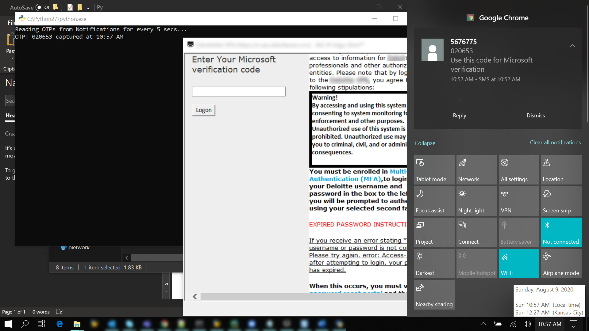
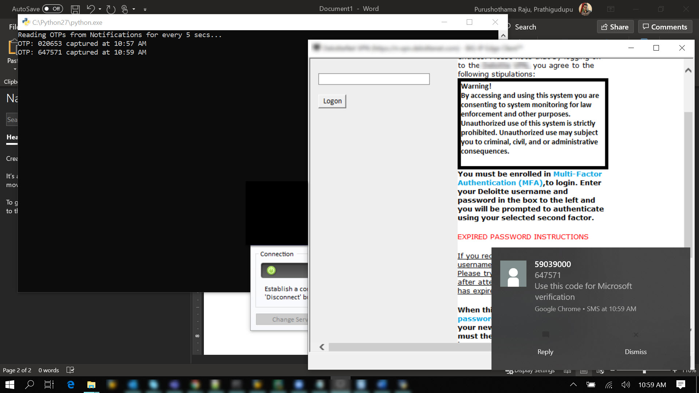

# autoReadOTP
Read OTP automatically for every 5 secs from the Notification that pops up for each SMS mirrored to PC via Pushbullet

### Pre-requisites for using this Utility:
1. Install Pushbullet on both Mobile Device(Android or iOS any) and Chrome Extension for PC.
2. Configure your account and Enable "SMS Sync" option in the Mobile App.

Once you setup the pre-requisites, you should be able to see the SMS notifications on your PC.

### Modules that need to be imported:
<table>
  <tr>
    <td><b><i>numpy</i></b></td>
    <td> Can be installed using "pip install numpy"</td>
  </tr>
  <tr>
    <td><b><i>clipboard</i></b></td>
    <td> Can be installed using "pip install pyperclip"</td>
  </tr>
  <tr>
    <td><b><i>cv2</i></b></td>
    <td> Can be installed using "pip install opencv-python"</td>
  </tr>
  <tr>
    <td><b><i>ImageGrab</i></b></td>
    <td> Can be installed using "pip install Pillow"</td>
  </tr>
  <tr>
    <td><b><i>pytesseract</i></b></td>
    <td>Can be installed using "pip install pytesseract" 
        Along with this, we need to dowload the tesseract executable file from the below link 
        https://github.com/UB-Mannheim/tesseract/wiki
    </td>
  </tr>
</table>

### How does this Utility work?
1. It grabs the Image of the Notification (both from Pop-up and the content from the Notification Tray which appears on the right side of the Desktop) using the module ImageGrab.
2. Reads the text from the Image using the module pytesseract through OCR.
3. Searches for the messages/notifications only the ones relevant for OTP based on the keywords 'OTP' or 'Verification' or 'Code'.
4. And if any of the keywords match, then it reads the 6-digit or 4-digit number from that message.
5. Once it reads the OTP, it would print it on the log and copy it to the clipboard automatically.

### How to test this Utility?
1. Generate an SMS relevant for OTP so that we get a notification on the PC (can be as a pop-up or in the Notification Tray).
2. Wait for 5 secs and just let the program take care of reading the OTP.
3. As it is automatically copied to the clipboard, you can just paste it where you need to fill it.

#### Message in the Notification Tray:
Note: Please note that we will have open the Notification Tray for the program to capture the image in order to read the OTP

#### Notification as a Pop-up:

